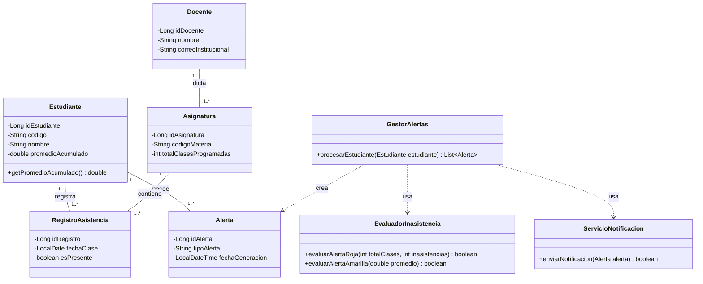

```mermaid
classDiagram
    %% Relaciones del Dominio
    Estudiante "1" -- "1..*" RegistroAsistencia : registra
    Estudiante "1" -- "0..*" Alerta : posee
    Docente "1" -- "1..*" Asignatura : dicta
    Asignatura "1" -- "1..*" RegistroAsistencia : contiene

    %% Relaciones de Lógica y Servicios (SOLID)
    GestorAlertas ..> EvaluadorInasistencia : usa
    GestorAlertas ..> ServicioNotificacion : usa
    GestorAlertas ..> Alerta : crea

    %% Entidades
    class Estudiante {
        -Long idEstudiante
        -String codigo
        -String nombre
        -double promedioAcumulado
        +getPromedioAcumulado() double
    }

    class Docente {
        -Long idDocente
        -String nombre
        -String correoInstitucional
    }

    class Asignatura {
        -Long idAsignatura
        -String codigoMateria
        -int totalClasesProgramadas
    }

    class RegistroAsistencia {
        -Long idRegistro
        -LocalDate fechaClase
        -boolean esPresente
    }

    class Alerta {
        -Long idAlerta
        -String tipoAlerta
        -LocalDateTime fechaGeneracion
    }

    %% Clases de Lógica y Servicios
    class EvaluadorInasistencia {
        +evaluarAlertaRoja(int totalClases, int inasistencias) boolean
        +evaluarAlertaAmarilla(double promedio) boolean
    }

    class GestorAlertas {
        +procesarEstudiante(Estudiante estudiante) List~Alerta~
    }

    class ServicioNotificacion {
        +enviarNotificacion(Alerta alerta) boolean
    }
```
